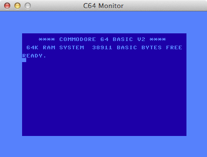

C64 Emulator written in PHP
===========================

    For the love of everything that is holy, why, oh god, why!!!!???!!

# TODO:
 - Complete the debugger
 - Load C64 disks and tapes (we can do PRG though)
 - Enable SID
 - Fix up VIC sprites
   
   
# Bugs & Things
 - Many.. but we have a functional testsuite that passes (hurrah!)

# Running the emulator
Since PHP isn't really capable of displaying graphics (PHP-GTK, maybe), we are using a shared memory block which is read
from a python (2.7) program (monitor.py).
 
This means that the following must take place:

  - Make sure you have pygame installed: `pip install pygame`
  - Start the monitor:  `python monitor.py`
  - Start the emulator in another console: `php c64.php`
 
 
# Files
  - c64.php <file.prg>
  Actual c64 emulator (with shm monitor output)
   
  - c64-debug.php <file.prg>
  Actual c64 emulator with debug information visible
  
  - c64-ws.php
  Websocket edition. Use with `web/index.html` to display monitor
  
  - c64-debugger.php
  Full debugger. Still much in progress.
  
  - c64-test.php
  Functional test system for all opcodes. Seems to be passing.
